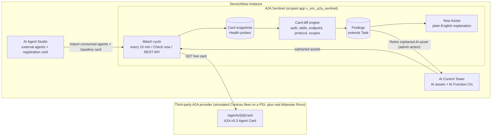

# A2A Sentinel

**Supply-chain assurance for the third-party AI agents your ServiceNow instance talks to.**

ServiceNow can now call external AI agents over the open [Agent2Agent (A2A)](https://a2a-protocol.org/) protocol,
for example Atlassian Rovo or a partner's LangGraph agent. AI Control Tower inventories those agents, but it
never tracks **what they can do** or **how that changes**. A2A Sentinel watches each consumed agent's live
*Agent Card*, keeps a versioned history, detects risky drift, and explains every finding in plain English with
Now Assist. It also cleans up AI assets whose agents no longer exist.

Built with the **ServiceNow SDK (Fluent)**, AI Agent Studio / A2A, AI Control Tower, and Now Assist (Generative AI Controller).

---

## The problem (verified in platform code)

| # | Gap in AI Control Tower (verified on sn_ai_governance 5.0.6 / sn_aia 6.0.23, re-verified on 7.0.1 / 8.0.12) | Consequence |
|---|---|---|
| 1 | The Agent Card is written to the CMDB only for agents ServiceNow **exposes**, not ones it **consumes** | Governance cannot see a third-party agent's skills or authentication |
| 2 | The consumed agent's card is captured **once**, at registration, and never refreshed | New destructive skills, removed auth or moved endpoints go unnoticed |
| 3 | The agent sync iterates only *existing* agents, so a deleted agent's asset stays **Deployed** | Stale AI inventory and CMDB |
| 4 | Only a *Retired* (or Cancelled) state takes an asset out of the licensing count | An orphaned asset can keep counting toward AI Control Tower licensing |
| 5 | The only external-agent security job covers AWS Bedrock; A2A endpoints are never probed | No health or posture signal for A2A agents |

Details, with code references: **[docs/evidence.md](docs/evidence.md)**

## What it does



| Capability | Detail |
|---|---|
| **Import consumed agents** | Reads AI Agent Studio external agents, resolves the Agent Card URL (card, then discovery record, then provider) and uses ServiceNow's own registration card as the baseline, so drift is measured *since registration*. Any other card URL can be watched manually. |
| **Versioned card history** | A SHA-256 over canonical JSON (key and skill order ignored), with one snapshot per distinct card and a full before/after for every change |
| **Drift detection** | Authentication removed (Critical), HTTPS downgraded (Critical), destructive skill added (High), auth downgraded (High), endpoint moved to another host (High), OAuth scope expansion, skill added/removed, protocol change, and change without a version bump (Medium), capability or skill wording changes (Low) |
| **Health** | HTTP status, latency, JSON and Agent Card validity. Degraded, then Down after N failures; auto-resolves on recovery |
| **Baseline posture** | No authentication declared, non-HTTPS endpoint, legacy `/.well-known/agent.json` path |
| **Orphan reconciliation** | AI assets whose agent was deleted, with deletion evidence from `sys_audit_delete`, plus an audited **Retire** action for the asset and CI |
| **Findings** | Extend Task (`A2AF…` numbers, state, work notes, priority from severity), fingerprint de-duplication, a Now Assist explanation with a deterministic fallback, a recommended action, and JSON evidence |
| **Automation API** | `GET /status`, `POST /run`, `POST /agents/{id}/check`, restricted to the admin role by a REST ACL |

## Verified runs

The full hands-on test plan (16 scenarios, [docs/test-plan.md](docs/test-plan.md)) was run end to end on 4 Oct 2026
on a lab with sn_aia 8.0.12 and AICT 7.0.1, after a first run on 30 Sep (sn_aia 6.0.23, AICT 5.0.6). Drift was
introduced on the provider side and picked up from ServiceNow:

| Finding | Severity | Agent |
|---|---|---|
| Agent no longer declares any authentication | Critical | Contoso Vendor Risk Agent |
| New skill "Delete vendor record" can change or delete data | High | Contoso Vendor Risk Agent |
| Runtime endpoint moved to a different host | High | Contoso Travel Booking Agent |
| Agent card unreachable (Down after 2 failed checks), **auto-closed on recovery** | High | Contoso Expense Policy Agent |
| Card changed without a version bump (still 1.4.2) | Medium | Contoso Vendor Risk Agent |
| Agent requests additional OAuth scopes (hr.records.read, later letters.send) | Medium | Contoso HR Letters Agent |
| Skill "Summarize receipts" was removed | Medium | Contoso Expense Policy Agent |
| A2A protocol version changed (0.3.0 -> 1.0.0) | Medium | Contoso HR Letters Agent |
| AI asset still Deployed but its agent no longer exists, **retired with the audited Retire action** | Medium | AI Control Tower inventory |
| Agent capabilities changed (streaming turned on) | Low | Contoso HR Letters Agent |
| Card published at legacy path /.well-known/agent.json (**real-world**) | Low | Atlassian Rovo |

The card ServiceNow stored when Rovo was registered and Rovo's live card produce the same SHA-256 hash, so there
were **no false positives**. An example Now Assist explanation (Critical finding):

> *The Contoso Vendor Risk Agent no longer declares any authentication method, changing from using an apiKey to none.
> This is critical because it removes a key security control, potentially allowing unauthorized access. Please review
> and restore appropriate authentication to ensure secure communication.*

## Repository layout

```
sentinel/   Fluent app x_snc_a2a_sentinel (the product)
  src/fluent/tables     Watched Agent, Card Snapshot, Health Probe, Finding (extends task)
  src/fluent/logic      Script Include, scheduled watch cycle, UI actions, properties
  src/fluent/api        Admin automation REST API (ACL-protected)
  src/fluent/security   Roles, ACLs, 13 declared cross-scope privileges
  src/fluent/ui         Forms, list layouts, navigator menu
  src/scripts           A2ASentinel.js (diff engine, probes, reconciliation)
fleet/      Fluent app x_2208133_a2afleet: simulated third-party provider publishing live A2A cards + JSON-RPC
docs/       evidence.md, test-plan.md, demo-script.md, migration.md, reset scripts
```

## Run it

Requirements: Node 20+, a ServiceNow instance with AI Agent Studio and AI Control Tower for the full feature set,
and a second instance (a PDI is fine) for the fleet.

```bash
# fleet (third-party provider) on your PDI
cd fleet && npm install && npm run build && npx @servicenow/sdk install --auth <pdi-alias>

# Sentinel on the instance that consumes agents
cd sentinel && npm install && npm run build && npx @servicenow/sdk install --auth <instance-alias>
```

Then go to **A2A Sentinel > Watched Agents > Run watch cycle**. Hands-on test plan: [docs/test-plan.md](docs/test-plan.md). Demo walkthrough: [docs/demo-script.md](docs/demo-script.md).
Moving to a new instance: [docs/migration.md](docs/migration.md).

## Design decisions

- **Extend AI Control Tower, don't duplicate it.** Sentinel reads AICT and AI Agent Studio data. It keeps card
  history in its own tables because AICT's hourly sync blanks the CI `card` field for consumed agents (Gap 1).
- **Least privilege.** Cross-scope access is declared per table and operation, only 2 tables are written outside
  the app (the AI asset and CI, from the explicit Retire action), and viewer and admin roles are separate.
- **Deterministic first, AI second.** Severity and detection are rule-based and explainable. The LLM only writes
  the narrative, and a property disables it with no loss of detection.
- **No noise.** Fingerprint de-duplication, canonical hashing (reordering is not drift), and recovery auto-closes
  health findings.

## Limitations and honest notes

- The Contoso agents are simulated, although served live over HTTPS from a separate instance; Atlassian Rovo is real.
- Gaps were verified on two releases (sn_aia 6.0.23 / AICT 5.0.6 and sn_aia 8.0.12 / AICT 7.0.1); ServiceNow may
  close them in later releases. The CI class already has `card` and `well_known_uri` fields.
- Health checks cover the card endpoint (status, latency, validity), not TLS certificate expiry or authenticated
  `message/send` probes. That is deliberate, to avoid billable calls to third-party agents.
- The *Retire orphaned AI asset* action modifies AI Control Tower records; review before using it in production.

## Roadmap

- Raise an AI Control Tower approval request for Critical drift, and suspend the external agent automatically
- Verify signed Agent Cards (A2A v0.3 `signatures`) and TLS certificate expiry
- Crawl domains and registries for unregistered A2A agents ("shadow agents")
- Performance Analytics dashboard: drift trend, mean time to detect, agents at risk

## References

- [A2A protocol specification](https://a2a-protocol.org/)
- ServiceNow Community: [Expose ServiceNow AI Agents to External Systems with Google A2A](https://www.servicenow.com/community/ceg-ai-coe-articles/expose-servicenow-ai-agents-to-external-systems-with-google-a2a/ta-p/3525805)
- ServiceNow Community: [ServiceNow as a primary A2A agent](https://www.servicenow.com/community/ceg-ai-coe-articles/servicenow-as-a-primary-a2a-agent-discovering-and-invoking/ta-p/3528579)
- ServiceNow Community: [What's new in AI Control Tower, Aug & Sep 2026](https://www.servicenow.com/community/ai-control-tower-articles/what-s-new-in-ai-control-tower-for-august-amp-september-2026/ta-p/3597749)
- [ServiceNow SDK (Fluent)](https://docs.servicenow.com/csh?topicname=servicenow-sdk-landing.html)

## License

[MIT](LICENSE)
